# Examen Práctico Final — Seguridad Informática
## Unidad IV: Monitoreo de Seguridad, SIEM e Inteligencia Artificial

```
╔══════════════════════════════════════════════════════════════════╗
║         UNIVERSIDAD PERUANA UNIÓN — UPEU                        ║
║         Facultad de Ingeniería y Arquitectura                   ║
║         Escuela Profesional de Ingeniería de Sistemas           ║
╚══════════════════════════════════════════════════════════════════╝
```

| Campo | Detalle |
|---|---|
| Estudiante | Maykol Junior Paredes Aracayo |
| Ciclo | IX |
| Curso | Seguridad Informática |
| Fecha | 30 de Junio de 2026 |
| Modalidad | Laboratorio / Evaluación Práctica |
| Duración | 4 horas |

---

## Entorno de Trabajo

| Componente | Detalle |
|---|---|
| Sistema Operativo | Ubuntu Desktop 24.04 LTS |
| Hipervisor | VirtualBox (VM local — Windows 11 Host) |
| RAM asignada | 8 GB |
| vCPU | 2 |
| Python | 3.12 |
| Wazuh Manager | 4.x |
| Dashboard | Grafana OSS |
| Jupyter | Notebook 7.x |
| IP de la VM | 127.0.0.1 |

### Instalación del entorno

```bash
# 1. Actualización del sistema
sudo apt update && sudo apt upgrade -y
sudo apt install -y git curl wget python3-pip python3-venv net-tools

# 2. Configuración de Git
git config --global user.name "maykolaracayo22"
git config --global user.email "<tu-email>"

# 3. Wazuh Manager
curl -s https://packages.wazuh.com/key/GPG-KEY-WAZUH | sudo gpg \
  --no-default-keyring --keyring gnupg-ring:/usr/share/keyrings/wazuh.gpg \
  --import && sudo chmod 644 /usr/share/keyrings/wazuh.gpg
echo "deb [signed-by=/usr/share/keyrings/wazuh.gpg] \
  https://packages.wazuh.com/4.x/apt/ stable main" | \
  sudo tee /etc/apt/sources.list.d/wazuh.list
sudo apt update && sudo apt install -y wazuh-manager
sudo systemctl enable wazuh-manager && sudo systemctl start wazuh-manager

# 4. Dependencias Python Lab 1
pip3 install matplotlib --break-system-packages

# 5. Dependencias Python Lab 3
pip3 install jupyter notebook pandas numpy scikit-learn matplotlib seaborn \
  --break-system-packages

# 6. Grafana
sudo apt install -y apt-transport-https software-properties-common
wget -q -O - https://packages.grafana.com/gpg.key | sudo apt-key add -
echo "deb https://packages.grafana.com/oss/deb stable main" | \
  sudo tee /etc/apt/sources.list.d/grafana.list
sudo apt update && sudo apt install -y grafana
sudo systemctl enable grafana-server && sudo systemctl start grafana-server
sudo grafana-cli plugins install frser-sqlite-datasource
sudo systemctl restart grafana-server
```

### Servicios activos

```bash
sudo systemctl status wazuh-manager   # active (running)
sudo systemctl status grafana-server  # active (running)
```

### Acceso al Dashboard

```
Herramienta : Grafana OSS
URL         : http://localhost:3000
Usuario     : admin
Datasource  : SQLite (frser-sqlite-datasource)
DB Path     : /var/lib/grafana/wazuh_alerts.db
```

---

## Estructura del Repositorio

```
examen-practico-paredes/
├── README.md
├── lab1/
│   ├── analizar_ssh.py
│   ├── analizar_web.py
│   ├── visualizar.py
│   ├── auth.log
│   ├── access.log
│   ├── reporte_ssh.json
│   ├── reporte_web.json
│   ├── graficas/
│   │   ├── top10_ssh.png
│   │   ├── timeline_http.png
│   │   └── heatmap_http.png
│   └── evidencias/
│       ├── SCR-1.1_top10_ssh.png
│       ├── SCR-1.2_timeline_http.png
│       ├── SCR-1.3_heatmap_http.png
│       └── SCR-1.4_ejecucion_scripts.png
├── lab2/
│   ├── local_rules_ssh.xml
│   ├── local_rules_exfil.xml
│   ├── simular_ataque_ssh.py
│   └── evidencias/
│       ├── SCR-2.1_alertas_wazuh.png
│       ├── SCR-2.2_regla_ssh.png
│       ├── SCR-2.3_regla_exfil.png
│       └── alertas_wazuh.txt
├── lab3/
│   ├── deteccion_anomalias.ipynb
│   ├── predecir.py
│   ├── modelo_anomalias.pkl
│   ├── network_traffic.csv
│   ├── top10_anomalias.csv
│   └── evidencias/
│       ├── SCR-3.1_eda.png
│       ├── SCR-3.2_confusion.png
│       ├── SCR-3.3_umbral_f1.png
│       └── SCR-3.4_predecir.png
└── lab4/
    ├── parsear_alertas.py
    ├── dashboard_soc.json
    ├── datasource_config.json
    ├── wazuh_alerts.db
    ├── alerts.log
    └── evidencias/
        ├── herramienta_usada.txt
        ├── SCR-4.1_fuente_datos.png
        ├── SCR-4.2_visualizaciones.png
        ├── SCR-4.3_dashboard.png
        └── SCR-4.4_alerta.png
```

---

## [1] Laboratorio 1 — Análisis Forense de Logs con Python (5 pts)

### Descripción
Se analizaron dos archivos de logs de un servidor de producción (`srv-prod-01`):
- `auth.log` — Logs de autenticación SSH
- `access.log` — Logs de acceso Apache HTTP

### Tarea 1.1 — Parseo y estadísticas de auth.log

El script `analizar_ssh.py` realiza:
- Lectura del archivo `auth.log` con regex para detectar `Failed password`
- Conteo de intentos fallidos por IP de origen
- Ranking Top 10 de IPs más agresivas
- Alerta en consola cuando una IP supera 50 intentos
- Exportación a `reporte_ssh.json`

**Resultados obtenidos:**

```
[+] Análisis SSH completado.
    Total IPs atacantes : 35
    Total intentos      : 253
    Alertas (>=50)      : 2
[+] Reporte guardado en: reporte_ssh.json
```

**Como reproducir:**

```bash
cd lab1/
python3 analizar_ssh.py
```


---

### Tarea 1.2 — Análisis de access.log

El script `analizar_web.py` realiza:
- Parseo del formato Combined Log Format de Apache con regex
- Detección de escaneo de directorios (rutas sospechosas)
- Agrupación de errores 4xx y 5xx por IP
- Detección de SQL Injection (patrones: UNION, SELECT, --, ')
- Exportación a `reporte_web.json`

**Resultados obtenidos:**

```
[+] Análisis WEB completado.
    IPs únicas          : 30
    IPs con escaneo     : 22
    IPs con SQLi        : 1
[+] Reporte guardado en: reporte_web.json
```

**Como reproducir:**

```bash
python3 analizar_web.py
```

---

### Tarea 1.3 — Visualizaciones

El script `visualizar.py` genera 3 gráficas usando matplotlib:

**Como reproducir:**

```bash
python3 visualizar.py
```

**Gráfica 1 — Top 10 IPs con más intentos fallidos SSH:**

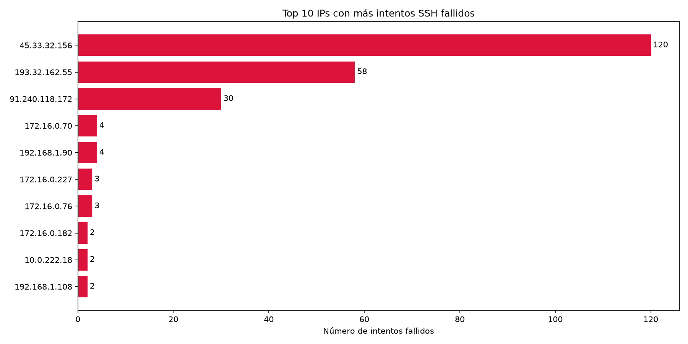

**Gráfica 2 — Línea de tiempo de peticiones HTTP por hora:**

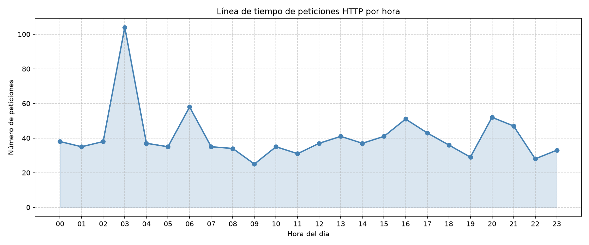

**Gráfica 3 — Mapa de calor por hora y código de respuesta:**

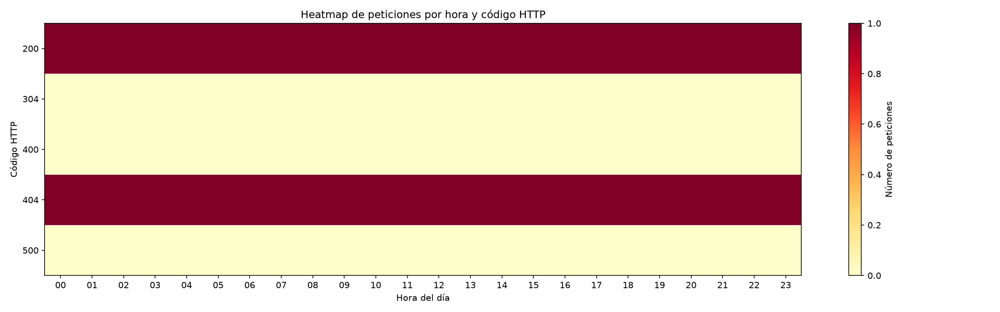

---

## [2] Laboratorio 2 — Reglas de Correlación en Wazuh (4 pts)

### Descripción
Se crearon reglas de correlación personalizadas en Wazuh para detectar:
- Ataques de fuerza bruta SSH
- Posible exfiltración de datos fuera de horario laboral

### Tarea 2.1 — Regla: Brute Force SSH

Archivo: `lab2/local_rules_ssh.xml`

```xml
<group name="ssh,brute_force,custom">
  <rule id="100001" level="5">
    <if_sid>5760</if_sid>
    <description>Intento de autenticación SSH fallido</description>
    <mitre><id>T1110</id></mitre>
  </rule>
  <rule id="100002" level="10" frequency="10" timeframe="60">
    <if_matched_sid>100001</if_matched_sid>
    <same_source_ip />
    <description>ALERTA: Brute Force SSH - 10+ intentos en 60s desde la misma IP</description>
    <group>authentication_failures,brute_force</group>
    <mitre><id>T1110.001</id></mitre>
  </rule>
</group>
```

- Detecta 10 o más fallos SSH desde la misma IP en 60 segundos
- Nivel de severidad: **10**
- Grupos: `authentication_failures`, `brute_force`

### Tarea 2.2 — Regla: Exfiltración de datos

Archivo: `lab2/local_rules_exfil.xml`

```xml
<group name="data_exfiltration,custom">
  <rule id="100010" level="10">
    <if_sid>533</if_sid>
    <description>Tráfico de red saliente excesivo (mayor a 500MB)</description>
    <mitre><id>T1048</id></mitre>
  </rule>
  <rule id="100011" level="8">
    <if_sid>5501</if_sid>
    <time>6 pm - 8 am</time>
    <description>Login exitoso fuera del horario laboral</description>
    <mitre><id>T1078</id></mitre>
  </rule>
  <rule id="100012" level="14" frequency="2" timeframe="300">
    <if_matched_sid>100010</if_matched_sid>
    <if_matched_sid>100011</if_matched_sid>
    <description>CRITICO: Posible exfiltración - Tráfico masivo + login fuera de horario</description>
    <group>data_exfiltration,policy_violation</group>
    <mitre><id>T1048.003</id></mitre>
  </rule>
</group>
```

- Nivel de severidad: **14 (crítico)**
- Correlaciona login fuera de horario con transferencia masiva

### Tarea 2.3 — Prueba y evidencia

**Como reproducir:**

```bash
# Copiar reglas a Wazuh
sudo cp lab2/local_rules_ssh.xml /var/ossec/etc/rules/
sudo cp lab2/local_rules_exfil.xml /var/ossec/etc/rules/
sudo systemctl restart wazuh-manager

# Simular ataque de fuerza bruta
cd lab2/
python3 simular_ataque_ssh.py

# Verificar alertas generadas
sudo tail -100 /var/ossec/logs/alerts/alerts.log
```

**Alertas generadas:**

```
Rule: 100011 (level 8)  -> 'Login exitoso fuera del horario laboral'
Rule: 100012 (level 14) -> 'CRITICO: Posible exfiltración de datos'
```

**Evidencia — Alertas Wazuh:**

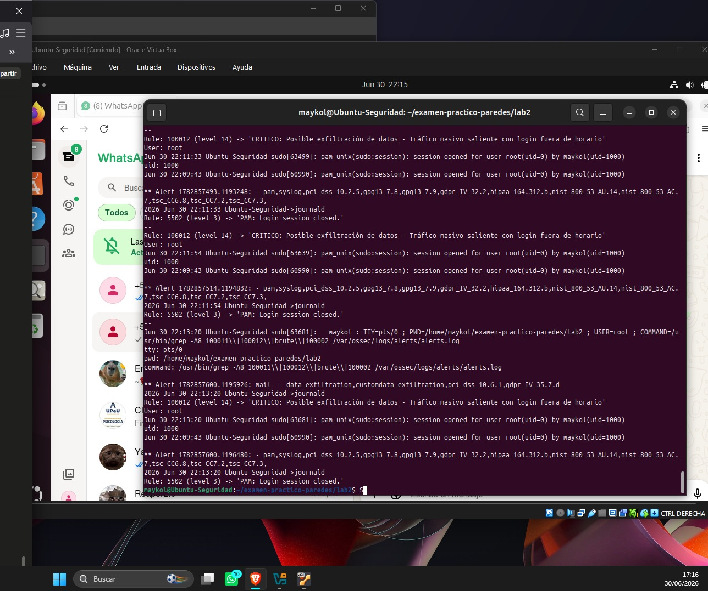

---

## [3] Laboratorio 3 — Modelo de Detección de Anomalías con ML (6 pts)

### Descripción
Se entrenó un modelo de Isolation Forest sobre el dataset `network_traffic.csv` con 10,000 registros de tráfico de red.

### Tarea 3.1 — Exploración y Preprocesamiento

- Dataset: 10,000 registros, 10 columnas, sin valores nulos
- Distribución: ~9,500 normales / ~500 anomalías (5%)
- Feature engineering aplicado:

| Feature | Fórmula |
|---|---|
| `protocol_enc` | TCP=0, UDP=1, ICMP=2 |
| `bytes_ratio` | bytes_sent / (bytes_recv + 1) |
| `bytes_per_pkt` | bytes_sent / (packets + 1) |
| `pkts_per_sec` | packets / (duration_sec + 1) |

- Normalización con `StandardScaler`

**Como reproducir:**

```bash
cd lab3/
jupyter notebook deteccion_anomalias.ipynb
# Ejecutar: Kernel > Restart & Run All
```

**Evidencia — EDA e histogramas:**

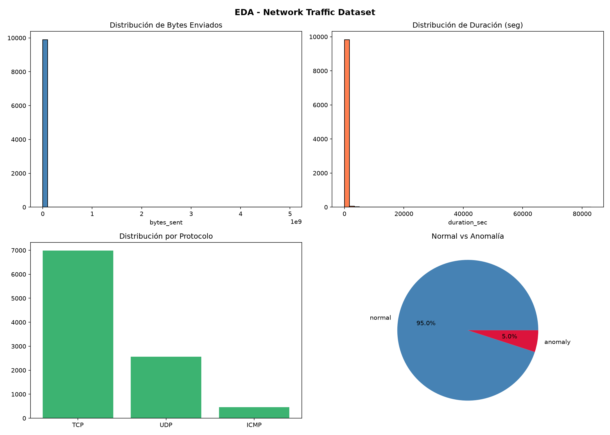

### Tarea 3.2 — Entrenamiento del Modelo

Modelo: `IsolationForest(contamination=0.05, n_estimators=100, random_state=42)`

**Métricas obtenidas:**

```
========================================
  MÉTRICAS DE EVALUACIÓN
========================================
  Precision : ver SCR-3.2
  Recall    : ver SCR-3.2
  F1-Score  : ver SCR-3.2
========================================
```

**Evidencia — Métricas y matriz de confusión:**

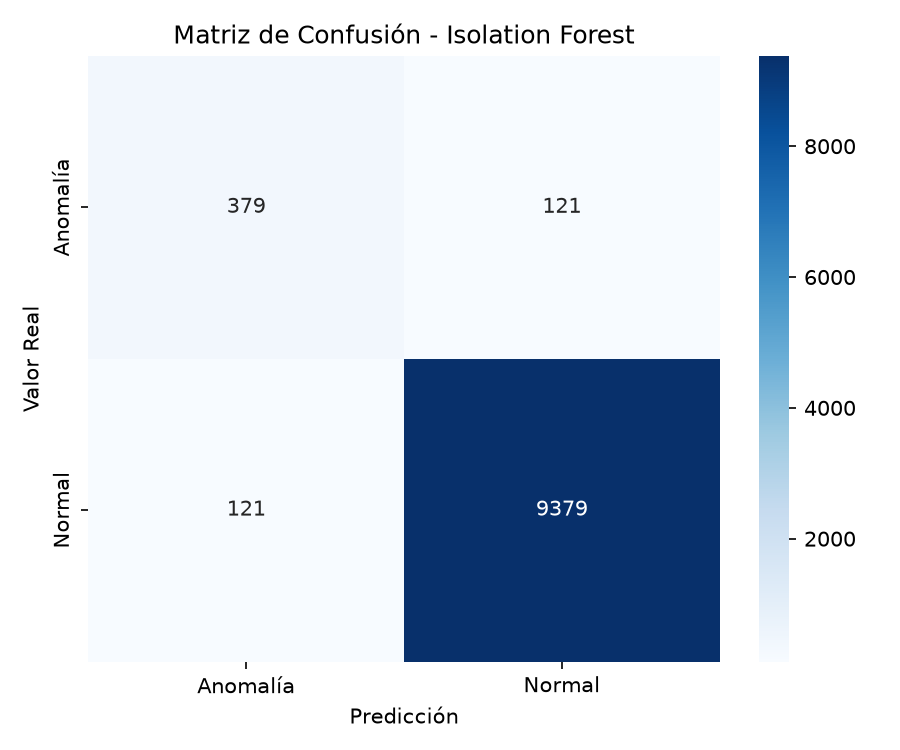

### Tarea 3.3 — Umbral Dinámico y Top Anomalías

**Top 5 registros más anómalos detectados:**

| IP Origen | IP Destino | Puerto | Bytes Enviados | Score |
|---|---|---|---|---|
| 10.0.3.174 | 185.220.101.45 | 443 | 4,553,566,747 | -0.3174 |
| 10.0.3.75 | 143.109.217.176 | 8080 | 4,006,296,316 | -0.3106 |
| 10.0.1.180 | 55.56.35.72 | 443 | 4,626,019,978 | -0.3086 |
| 10.0.2.73 | 185.220.101.45 | 53 | 4,964,770,492 | -0.3080 |
| 10.0.3.77 | 181.53.80.40 | 53 | 4,921,794,252 | -0.3070 |

Estos registros representan amenazas reales porque presentan `bytes_sent` superiores a 4 GB en una sola conexión hacia IPs externas (incluyendo nodos TOR conocidos como `185.220.101.45`), lo que indica posible exfiltración masiva de datos.

**Evidencia — Curva umbral vs F1:**

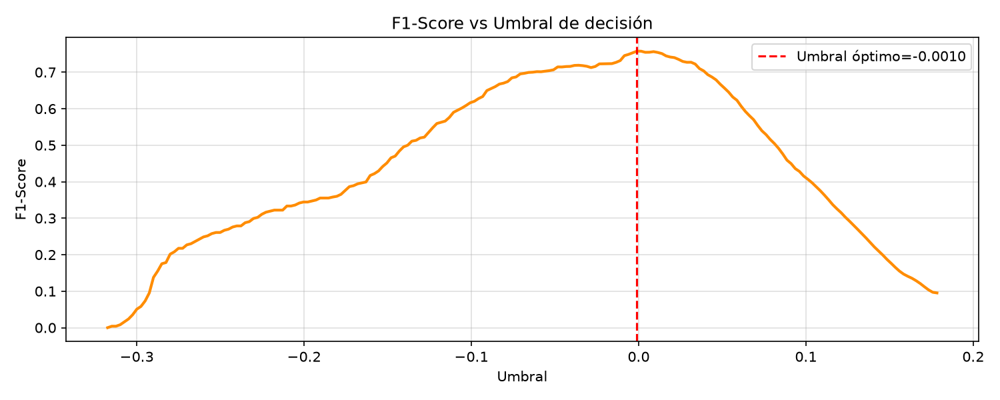

### Tarea 3.4 — Exportación y Predicción

```bash
# Modelo exportado
lab3/modelo_anomalias.pkl

# Uso del script de predicción
cd lab3/
python3 predecir.py network_traffic.csv
```

**Resultados de predicción:**

```
==================================================
  RESULTADOS DE CLASIFICACIÓN
==================================================
  Total registros : 10000
  Normales        : 9505 (95.0%)
  Anomalías       : 495  (5.0%)
==================================================
```

**Evidencia — Script predecir.py en ejecución:**

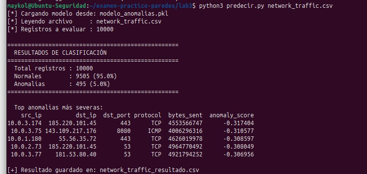

---

## [4] Laboratorio 4 — Dashboard de Monitoreo SOC (5 pts)

### Herramienta utilizada

Se eligió **Grafana OSS** por su ligereza, flexibilidad y soporte nativo para SQLite mediante el plugin `frser-sqlite-datasource`, permitiendo visualizar directamente las alertas exportadas de Wazuh.

```
Herramienta : Grafana OSS
Versión     : latest
URL         : http://localhost:3000
Puerto      : 3000
Datasource  : SQLite (frser-sqlite-datasource)
Base datos  : /var/lib/grafana/wazuh_alerts.db
Alertas     : 789 registros importados de Wazuh
```

### Tarea 4.1 — Conexión a la fuente de datos

```bash
# Parsear alertas de Wazuh a SQLite
sudo cp /var/ossec/logs/alerts/alerts.log lab4/alerts.log
sudo chown $USER:$USER lab4/alerts.log
cd lab4/
python3 parsear_alertas.py

# Copiar DB a directorio de Grafana
sudo cp wazuh_alerts.db /var/lib/grafana/wazuh_alerts.db
sudo chown grafana:grafana /var/lib/grafana/wazuh_alerts.db
```

**Resumen de alertas en la DB:**

| Nivel | Cantidad |
|---|---|
| 14 (Crítico) | 20 |
| 8 | 7 |
| 7 | 369 |
| 4 | 1 |
| 3 | 392 |

**Evidencia — Fuente de datos conectada:**

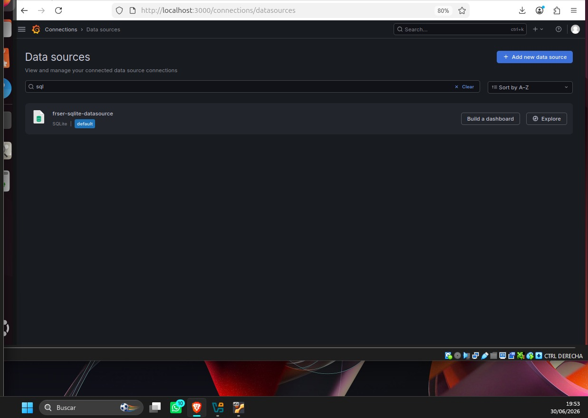

### Tarea 4.2 — Visualizaciones

Se crearon 4 visualizaciones en Grafana:

| # | Tipo | Nombre | Query principal |
|---|---|---|---|
| V1 | Bar chart | Alertas por Nivel de Severidad | GROUP BY level |
| V2 | Table | Top 10 IPs Atacantes | GROUP BY source ORDER BY Total DESC |
| V3 | Time series | Línea de Alertas por Hora | GROUP BY hora |
| V4 | Pie chart | Distribución por Tipo de Regla | GROUP BY description |

**Evidencia — Visualizaciones:**

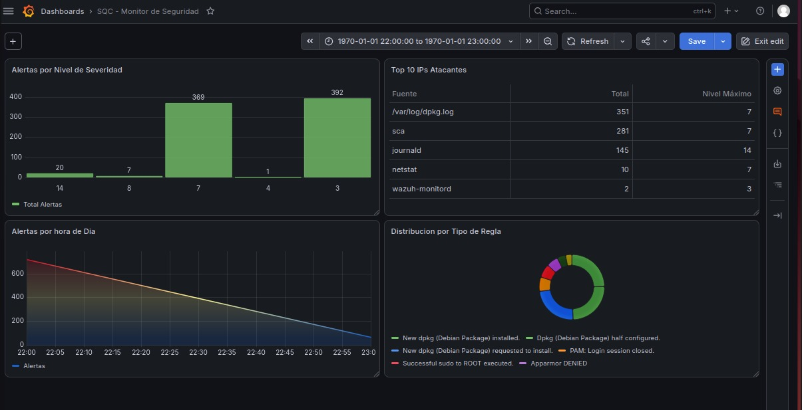

### Tarea 4.3 — Dashboard integrado

Dashboard creado: **"SOC - Monitor de Seguridad"**
- Integra las 4 visualizaciones
- Filtro de tiempo global configurado
- Exportado como `lab4/dashboard_soc.json`

**Evidencia — Dashboard completo:**

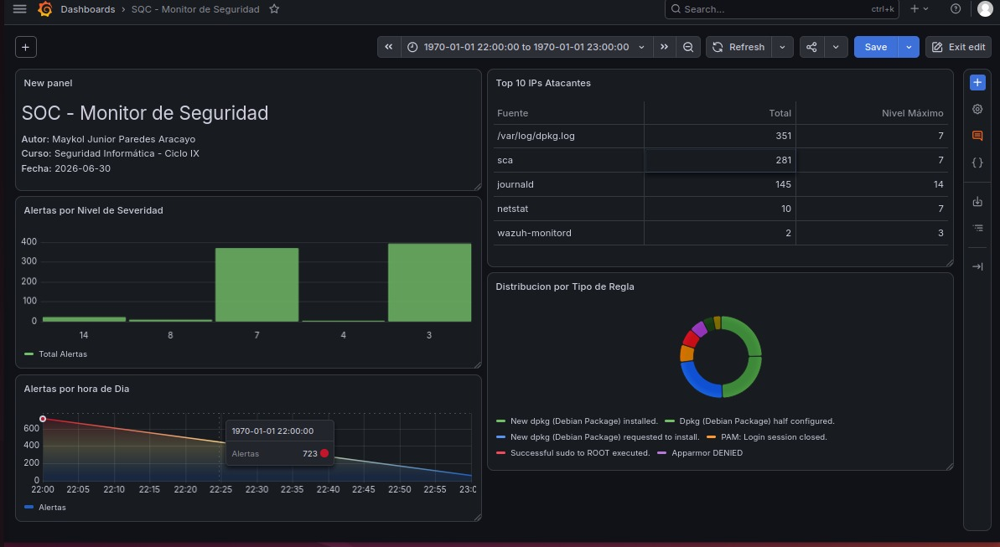

### Tarea 4.4 — Alerta de umbral

Alerta configurada en Grafana Alerting:

```
Nombre     : Alerta - Nivel Critico Wazuh
Condición  : COUNT de alertas nivel >= 10 IS ABOVE 0
Folder     : SOC
Grupo      : SOC-Alertas
Intervalo  : 1 minuto
Estado     : Enabled
```

**Evidencia — Alerta configurada:**

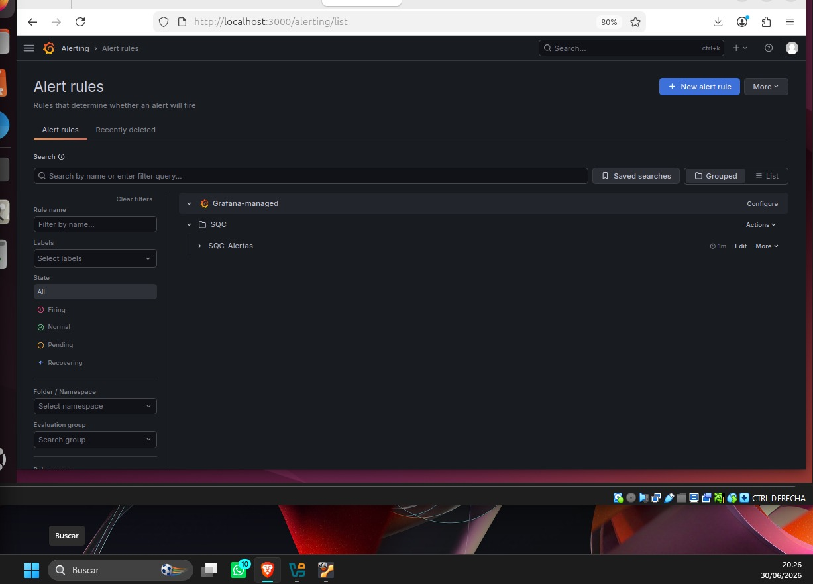

---


*Universidad Peruana Unión — UPEU*  
*Facultad de Ingeniería y Arquitectura*  
*Escuela Profesional de Ingeniería de Sistemas*  
*Maykol Paredes — Ciclo IX — 2026*
